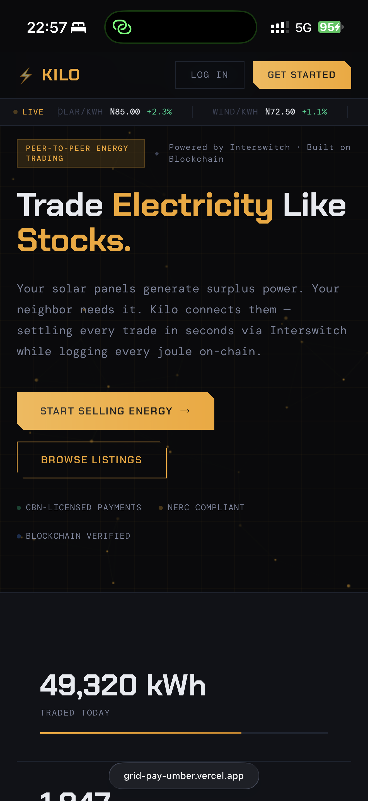
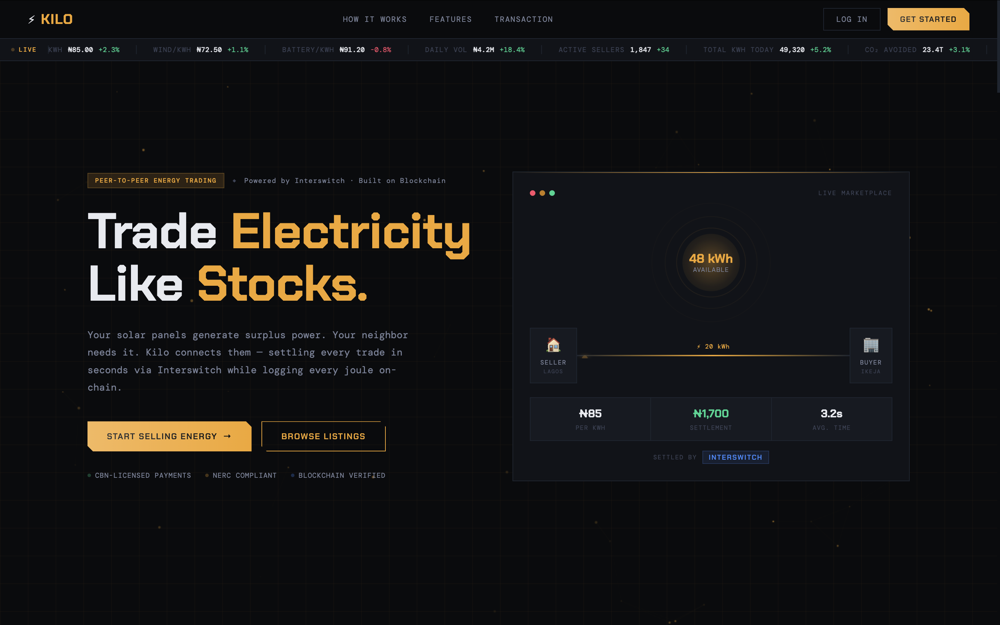
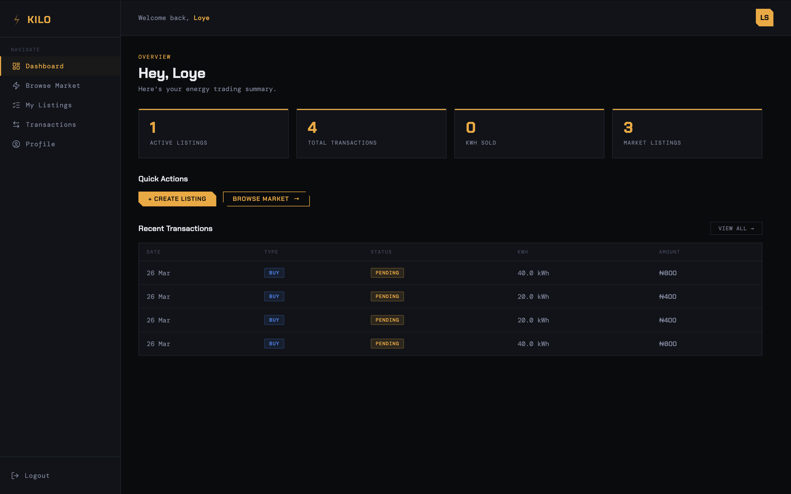

# Kilo — P2P Solar Energy Trading Platform

> Built for the **Enyata × Interswitch Hackathon**

---

## Live Links & External Repos

- React frontend (Hosted with vercel) : [https://grid-pay-umber.vercel.app/](https://grid-pay-umber.vercel.app/)
- Backend Repo hosted with Microsoft Azure : [https://github.com/Otormin/Kilo-Backend](https://github.com/Otormin/Kilo-Backend)

# Swagger Docs

- FastAPI swagger: [https://gridpay-yrjt.onrender.com/docs](https://gridpay-yrjt.onrender.com/docs)
- ASP.NET swagger: [https://kilo-backend-api-hqh6h2esbzgcavex.westeurope-01.azurewebsites.net/swagger/index.html](https://kilo-backend-api-hqh6h2esbzgcavex.westeurope-01.azurewebsites.net/swagger/index.html)

---

## Screenshots

<table>
  <tr>
    <td valign="top">
      
    </td>
    <td valign="top">
      <br/><br/>
      
    </td>
  </tr>
</table>

---

## The Problem

Nigeria's electricity grid is chronically unstable. Millions of households and businesses have invested in solar systems to cope — but solar panels generate more electricity than a single household can consume, especially during peak sunlight hours. That surplus energy is wasted while a neighbour down the street is running a generator at ₦1,500 per litre of fuel or simply sitting in darkness.

There is no mechanism for solar owners to monetise their surplus, and no affordable, real-time way for energy-poor neighbours to buy from them.

---

## The Solution — Kilo

**Kilo** is a peer-to-peer energy marketplace. Solar owners list their surplus electricity at a price they choose. Buyers browse available listings, select how many kilowatt-hours they need, and pay instantly via the Interswitch payment gateway. The energy delivery is tracked in real time through smart meter integration.

```
Solar Owner                  Kilo Platform                    Buyer
     │                            │                              │
     ├─ Add Smart Meter ─────────►│                              │
     ├─ Create Listing (₦/kWh) ──►│                              │
     │                            │◄─── Browse Listings ─────────┤
     │                            │◄─── Buy X kWh ───────────────┤
     │                            │──── Interswitch Payment ────►│
     │                            │◄─── Payment Confirmed ───────┤
     │◄─ Energy Locked ───────────┤                              │
     │◄─ Deliver kWh (real-time) ─┤──── Delivery Logs ──────────►│
     │                            │──── Status: Completed ──────►│
```

### Key Features

- **Smart meter integration** — meters report generated and consumed kWh; surplus is calculated automatically
- **Live marketplace** — browse active listings filtered by location
- **Full payment flow** — Interswitch Web Checkout (hosted payment page, form POST redirect, server-side requery verification, kobo-denominated)
- **Real-time delivery tracking** — energy delivery logs update every 10 seconds via background service
- **Transaction history** — full audit trail of every trade with status progression
- **Roles** — same account can be both buyer and seller

---

## Interswitch API Integration

Payments are processed through the **Interswitch Web Checkout** flow:

1. **Payment initiation** — FastAPI generates a transaction reference (`KILO-XXXXXXXXXXXX`) and returns merchant parameters to the frontend. The amount is denominated in kobo (₦1 = 100 kobo).
2. **Hosted payment page** — the frontend submits a hidden HTML form via POST directly to the Interswitch WebPay URL. The buyer completes payment on Interswitch's hosted page.
3. **Redirect callback** — Interswitch POSTs the `txnref` back to the Kilo backend (`/api/payments/redirect`), which reads the form body and 302-redirects the browser to the frontend callback page.
4. **Server-side verification** — the frontend calls the Kilo backend, which requeries the Interswitch `gettransaction` API using the merchant code and transaction reference to confirm the payment status and amount.
5. **Confirmation** — once verified, the ASP.NET energy engine locks energy and begins delivery. The seller's earnings are recorded in MongoDB.

---

## Architecture

```
┌─────────────────────────────────────────────────────────────┐
│                     React Frontend (Vite)                   │
│  Landing · Browse · Dashboard · Listings · Transactions ··· │
└──────────────────────────┬──────────────────────────────────┘
                           │ HTTPS / JWT
┌──────────────────────────▼──────────────────────────────────┐
│               FastAPI Middleware (Python)                   │
│  Auth (JWT + MongoDB)  ·  Payment Proxy (Interswitch)       │
│  Proxy routes → ASP.NET for all domain operations           │
└──────────────────────────┬──────────────────────────────────┘
                           │ HTTP (internal)
┌──────────────────────────▼──────────────────────────────────┐
│           ASP.NET Core Energy Engine (C#)                   │
│  Meters · Listings · Transactions · Energy Delivery         │
│  Background: SurplusService (60s) · DeliveryService (10s)   │
└──────────────────────────┬──────────────────────────────────┘
                           │ EF Core
                     SQL Server DB
```

---

## Tech Stack

| Layer         | Technology                                                                       |
| ------------- | -------------------------------------------------------------------------------- |
| Frontend      | React 19, TypeScript, Vite, Zustand, React Router v6                             |
| Styling       | Pure CSS with design tokens (no Tailwind), Chakra Petch + DM Mono                |
| Middleware    | FastAPI (Python 3.11), httpx, PyJWT, Motor (async MongoDB)                       |
| Energy Engine | ASP.NET Core 8, Entity Framework Core, SQL Server                                |
| Payments      | Interswitch Web Checkout (hosted page, form POST redirect, requery verification) |
| Auth DB       | MongoDB Atlas                                                                    |
| Energy DB     | SQL Server                                                                       |

---

## Project Structure

```
Kilo/
├── client/              # React + TypeScript frontend
│   └── src/
│       ├── pages/       # Public pages (Landing, Login, Register, Browse, PaymentCallback)
│       ├── secure/      # Protected pages (Dashboard, MyListings, Transactions, Profile)
│       ├── services/    # API call wrappers (listings, transactions, payments, meters, logs)
│       ├── store/       # Zustand auth store
│       ├── types/       # Shared TypeScript interfaces
│       └── components/  # Reusable UI components
│
├── server/              # FastAPI middleware + ASP.NET energy engine
│   ├── app/             # FastAPI application
│   │   ├── routers/     # Route handlers (auth, listings, transactions, payments, meters)
│   │   ├── services/    # Proxy service functions (httpx calls to ASP.NET)
│   │   └── config/      # Settings (env vars)
│   └── KiloBackend/    # ASP.NET Core project
│       ├── Controllers/ # API controllers
│       ├── Services/    # Domain services + background workers
│       └── Models/      # EF Core entities + DTOs
│
└── README.md
```

---

## Setup

### Prerequisites

- Node.js 20+
- Python 3.11+
- .NET 8 SDK
- SQL Server (local or Azure)
- MongoDB Atlas account (or local MongoDB)
- Interswitch developer account (sandbox credentials)

---

### 1. ASP.NET Energy Engine

```bash
cd server/KiloBackend
```

Create `appsettings.Development.json`:

```json
{
  "ConnectionStrings": {
    "DefaultConnection": "Server=localhost;Database=KiloDB;Trusted_Connection=True;"
  }
}
```

Run migrations and start:

```bash
dotnet ef database update
dotnet run
# Runs on http://localhost:5000
```

---

### 2. FastAPI Middleware

```bash
cd server
python -m venv venv
source venv/bin/activate        # Windows: venv\Scripts\activate
pip install -r requirements.txt
```

Create `.env`:

```env
MONGO_URI=mongodb+srv://<user>:<pass>@cluster.mongodb.net/Kilo
JWT_SECRET=your_jwt_secret_here
ENERGY_ENGINE_URL=http://localhost:5000
INTERSWITCH_MERCHANT_CODE=your_merchant_code
INTERSWITCH_PAY_ITEM_ID=your_pay_item_id
INTERSWITCH_BASE_URL=https://sandbox.interswitchng.com
CLIENT_URL=frontend-url
```

Start:

```bash
uvicorn app.main:app --reload --port 8000
# API docs at http://localhost:8000/docs
```

---

### 3. React Frontend

```bash
cd client
npm install
```

Create `.env`:

```env
VITE_API_BASE_URL=fastapi_backend_url
```

Start:

```bash
npm run dev
# Runs on http://localhost:5173
```

---

## Demo Credentials

| Role   | Email                  | Password     |
|--------|------------------------|--------------|
| Seller | <seller@kilotest.com>    | Demo1234!    |
| Buyer  | <buyer@kilotest.com>     | Demo1234!    |

---

## Testing the Full Buy Flow

1. Register two accounts (User A = seller, User B = buyer)
2. **User A**: go to Profile → add a smart meter (e.g. `KL-2025-0001`)
3. **User A**: go to My Listings → create a listing (location, ₦/kWh, select meter)
4. **User B**: go to Browse → find User A's listing → click "Buy Energy"
5. Enter kWh amount → Proceed to Payment → redirected to Interswitch sandbox
6. Complete test payment on Interswitch sandbox page with the following card details:  

  > Card number: **5061050254756707864**
  > Expiry: **06/26**
  > CVV: **111**
  > PIN: **1111**
  > OTP: **123456**
1. Redirected back to `/payment/callback` → payment verified + confirmed automatically
2. **User B**: check Transactions — status progresses: `PendingPayment → Paid → EnergyLocked → Delivering → Completed`
3. Click any transaction row to see real-time energy delivery logs

---

## Team

### Setemi Loye — Frontend + FastAPI Middleware

- Designed and built the complete React/TypeScript frontend: landing page, public marketplace with buy flow, authenticated dashboard, listings management, transaction history, and profile pages
- Built the FastAPI middleware layer: user authentication (JWT + MongoDB), Interswitch Web Checkout integration (payment initiation, redirect handling, transaction verification), and all proxy routes connecting the frontend to the ASP.NET energy engine
- Integrated the full Interswitch Web Checkout flow end-to-end: hidden form POST to the Interswitch hosted payment page, backend redirect endpoint to receive the post-payment callback, cross-redirect state persistence (sessionStorage), server-side verification via the Interswitch requery API, and transaction confirmation

### Jesse Young — ASP.NET Core Energy Engine

- Designed and built the core energy trading backend: meter management, listing CRUD, full transaction lifecycle state machine, and energy delivery simulation
- Implemented two background services: `SurplusBackgroundService` (polls meters every 60s to update surplus) and `EnergyDeliveryService` (delivers energy in increments every 10s for active transactions)
- Built the complete API surface consumed by the FastAPI proxy: Meter, Listing, Transaction, and EnergyLog controllers with Entity Framework Core + SQL Server

---

## Hackathon

Built for the **Enyata × Interswitch Hackathon** — a challenge to build innovative fintech solutions leveraging the Interswitch payment infrastructure.

Kilo demonstrates real-world use of the Interswitch Payment Gateway for a novel use case: monetising renewable energy surplus at the community level.
